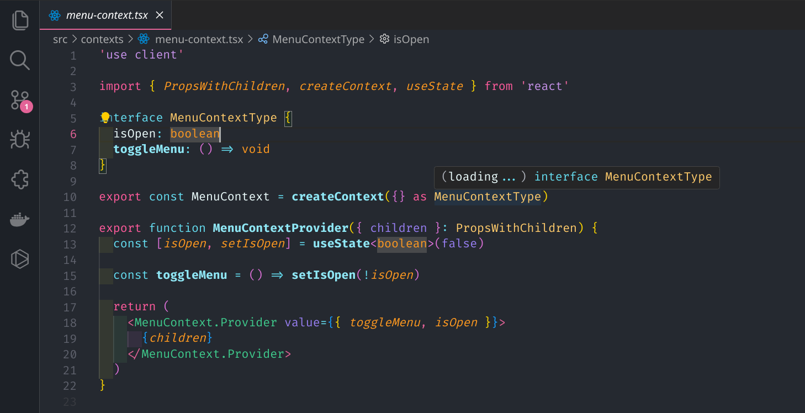

<h1 align="center">
   
  
   
  Pitaya Theme for <a href="https://code.visualstudio.com/">Visual Studio Code</a>
   
</h1>

  <strong>Cozy and minimalist dark theme for VS Code.</strong>

  
  
  

  <a href="#disclaimer">Disclaimer</a> •
  <a href="#install">Install</a> •
  <a href="#license">License</a>

  

## Disclaimer

This theme is an harmonious blend of professionalism and comfort in your workspace. Immerse yourself in productivity with a sleek, dark backdrop accentuated by subtle pink hues. This theme combines style and functionality for a refined coding experience.

## Install

1. Hit Cmd+P(Mac), or Ctrl + P(Windows) to open the Command palette.
2. Paste this— `ext install GustavoDiasdeAlmeida.pitaya`
3. Hit Enter
4. Hit Cmd+Shift+P / Ctrl+Shift+P, and type "Color theme" and hit enter.
5. You should now see Code Blue in the list. Select and hit enter again.

## Additional steps

6. Chill and code at the magnificent colours. 🤩
7. Rate it 5 ⭐ in the [VSCode Marketplace](https://marketplace.visualstudio.com/items?itemName=GustavoDiasdeAlmeida.pitaya).

## License

[MIT License](./LICENSE.md)